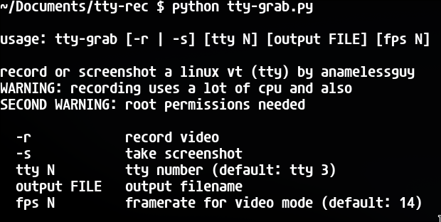

# what is tty-grab??
well tty-grab is a tool for linux that records or screenshots your tty! yes!
# wow this is cool!! how do i run it??
### dependencies you need
ffmpeg

python

numpy from python's package manager called pip

and then just run it with python

